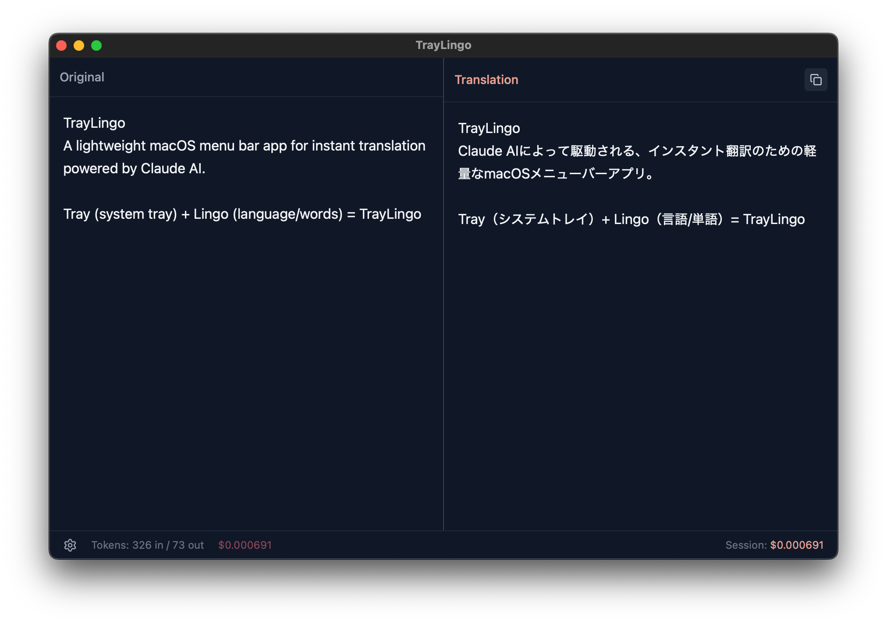

# TrayLingo

[](LICENSE)
[](https://github.com/ebiyy/traylingo/actions/workflows/ci.yml)
[](https://github.com/ebiyy/traylingo/releases)
[](https://github.com/ebiyy/traylingo)
[](https://github.com/ebiyy/traylingo/releases)

A lightweight macOS menu bar app for instant translation powered by Claude AI.

**Tray** (system tray) + **Lingo** (language/words) = TrayLingo



## Features

- **Global Shortcut**: Press `Cmd+J` to translate selected text instantly
- **Streaming Translation**: See translations appear in real-time
- **Auto Language Detection**: Automatically translates Japanese to English and vice versa
- **Code Block Preservation**: Technical content and code blocks remain intact
- **Token Usage Tracking**: Monitor API usage and costs per request and session
- **Menu Bar Integration**: Lives quietly in your system tray

## Cost Efficiency

TrayLingo is designed to minimize API costs while maintaining translation quality.

### Estimated Cost per Translation (Claude Haiku 4.5)

| Text Length | Characters | Est. Cost |
|-------------|------------|-----------|
| Short (tweet) | ~100 | ~$0.0004 |
| Medium (paragraph) | ~500 | ~$0.0008 |
| Long (page) | ~2000 | ~$0.002 |

*Actual costs vary based on language and content complexity.*

### Cost Optimizations

| Feature | Savings | Description |
|---------|---------|-------------|
| **Prompt Caching** | 25-45% | System prompt cached via Anthropic API (90% off cached tokens) |
| **Translation Cache** | 100% | Same text = instant return from local cache (no API call) |
| **Optimized Prompt** | 10-20% | Compressed system prompt (~150 tokens vs ~200) |

**Real-world example**: 2 days of moderate use ≈ $0.80 USD (~1000 translations)

## Installation

### Homebrew (Recommended)

```bash
brew install --cask ebiyy/tap/traylingo
```

> **Note:** Apple Silicon (M1/M2/M3) only. Intel Mac support coming soon.

### Download

Download the `.dmg` file from [Releases](https://github.com/ebiyy/traylingo/releases) and drag TrayLingo to your Applications folder.

### Build from Source

#### Prerequisites

- macOS 10.15+
- [Rust](https://rustup.rs/) (1.70+)
- [Node.js](https://nodejs.org/) (20+)
- [pnpm](https://pnpm.io/) (10+)

```bash
# Clone the repository
git clone https://github.com/ebiyy/traylingo.git
cd traylingo

# Install dependencies
pnpm install

# Run in development mode
pnpm tauri dev

# Build for production
pnpm tauri build
```

The built app will be in `src-tauri/target/release/bundle/`.

## Usage

### Setup

1. Get an Anthropic API key from [console.anthropic.com](https://console.anthropic.com/)
2. Launch TrayLingo and open Settings (gear icon in the main window)
3. Paste your API key and click Save

### Translating Text

1. Select any text in any application
2. Press `Cmd+J`
3. TrayLingo will automatically copy the selected text, translate it, and display the result

### Controls

- **Left-click** on tray icon: Toggle window visibility
- **Right-click** on tray icon: Open menu (Quit)
- **Cmd+J**: Translate selected text (main window)
- **Ctrl+Option+J**: Quick translate popup (minimal UI, auto-closes)

### Troubleshooting

#### "TrayLingo is damaged" (macOS Gatekeeper)

TrayLingo is not yet notarized by Apple. If you trust this source, you can bypass Gatekeeper:

```bash
xattr -cr /Applications/TrayLingo.app
```

> **Security note:** Only run this command for binaries from sources you trust. When in doubt, [build from source](#build-from-source).

#### Error Reports

If an error occurs, click the **"Copy Report"** button to copy error details. You can paste this directly into a [GitHub Issue](https://github.com/ebiyy/traylingo/issues) for support.

## Tech Stack

- **Framework**: [Tauri v2](https://tauri.app/)
- **Frontend**: [Solid.js](https://www.solidjs.com/) + [Tailwind CSS v4](https://tailwindcss.com/)
- **Backend**: Rust
- **AI**: Claude Haiku 4.5 (Anthropic)
- **Error Monitoring**: [Sentry](https://sentry.io/)

## Configuration

Select a model in Settings. Available models:

| Model ID | Speed | Input | Output |
|----------|-------|-------|--------|
| `claude-haiku-4-5-20251001` (default) | Fast | $1/1M | $5/1M |
| `claude-sonnet-4-5-20250514` | Best | $3/1M | $15/1M |
| `claude-3-5-sonnet-20241022` | Good | $3/1M | $15/1M |
| `claude-3-5-haiku-20241022` | Fast | $0.8/1M | $4/1M |

Your API key and preferences are stored locally in `settings.json`. Translation cache can be disabled or cleared in Settings.

## Privacy

See [PRIVACY.md](PRIVACY.md) for our privacy policy.

**TL;DR:** Error reports are sent to Sentry by default to help improve the app. No translation content is ever collected. You can disable error reporting in Settings.

## Documentation

- [Architecture](docs/architecture.md) - System design and module structure
- [Error Management](docs/error-management.md) - Error handling strategy and logging
- [Privacy Policy](PRIVACY.md) - Data collection and opt-out options
- [Roadmap](ROADMAP.md) - Planned features and progress

Documentation is written in English to welcome global contributors. We keep docs minimal: architecture overview + specific technical topics only.

## Contributing

Contributions are welcome! Please read our [Contributing Guide](CONTRIBUTING.md) before submitting a PR.

### Platform Support

Currently macOS only. Contributions to add Linux and Windows support are especially welcome!

## License

[MIT](LICENSE)

## Acknowledgments

Built with [Tauri](https://tauri.app/), [Solid.js](https://www.solidjs.com/), and [Anthropic Claude](https://www.anthropic.com/).
