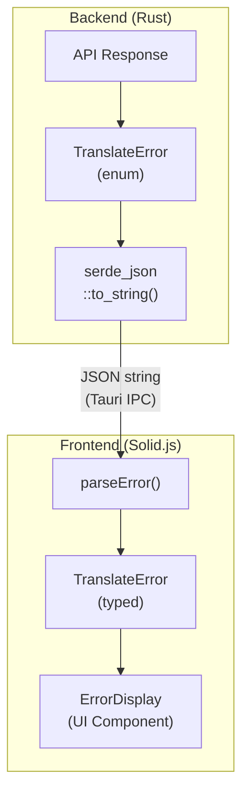

# Error Management Strategy

This document outlines TrayLingo's approach to error handling, logging, and monitoring.

## Overview

TrayLingo uses a **structured error approach** with typed errors that flow from Rust backend to TypeScript frontend, enabling consistent error handling and user-friendly messages.

## Architecture



## Error Types

### TranslateError Enum

| Type | Trigger | HTTP Status | Retryable |
|------|---------|-------------|-----------|
| `ApiKeyMissing` | No API key configured | - | No (needs settings) |
| `AuthenticationFailed` | Invalid API key | 401 | No (needs settings) |
| `RateLimitExceeded` | Too many requests | 429 | Yes (with delay) |
| `Overloaded` | Claude API overloaded | 529 | Yes (with delay) |
| `Timeout` | Request timeout | - | Yes |
| `NetworkError` | Connection failed | - | Yes |
| `ApiError` | Other API errors | 4xx/5xx | Depends |
| `ParseError` | Invalid response format | - | Yes |
| `Unknown` | Unexpected errors | - | No |

### File Locations

| Layer | File | Purpose |
|-------|------|---------|
| Rust | `src-tauri/src/error.rs` | Error enum definition |
| TypeScript | `src/types/error.ts` | Type definitions + utilities |
| UI | `src/components/ErrorDisplay.tsx` | Error display component |

## Frontend Utilities

```typescript
import { parseError, getUserMessage, isRetryable, needsSettings, getRetryDelay } from './types/error';

// Parse error from backend
const error = parseError(backendError);

// Get user-friendly message
const message = getUserMessage(error);

// Check if retryable
if (isRetryable(error)) {
  const delay = getRetryDelay(error);
  // Retry after delay
}

// Check if needs API key configuration
if (needsSettings(error)) {
  // Show settings button
}
```

## Logging Strategy

### Current Implementation

TrayLingo uses `tauri-plugin-log` for local logging:

```rust
// Cargo.toml
tauri-plugin-log = "2"
log = "0.4"
```

Log files are stored in the app's data directory:
- macOS: `~/Library/Logs/com.traylingo.app/`

### Recommended Usage

```rust
use log::{info, warn, error, debug};

// In translate_stream():
info!("Starting translation: {} chars", text.len());
error!("API error: status={}, body={}", status, body);
warn!("Rate limited, retry_after={:?}", retry_after);
debug!("Stream chunk received: {} bytes", chunk.len());
```

### Log Levels

| Level | Use Case |
|-------|----------|
| `error!` | Failed operations, API errors |
| `warn!` | Rate limits, retryable failures |
| `info!` | Successful operations, state changes |
| `debug!` | Detailed debugging info (dev only) |

## Error Monitoring Tools

### Do We Need Sentry?

**For TrayLingo: Not recommended at this stage.**

| Consideration | Assessment |
|---------------|------------|
| App type | Local menu bar utility |
| User base | Personal/small OSS |
| Error frequency | Low (API errors mostly) |
| Privacy | API keys in error context = risk |
| Maintenance | Extra dependency to maintain |

### When Sentry Makes Sense

- Large user base needing crash analytics
- Complex error patterns to analyze
- Team needing shared error visibility
- Production stability monitoring

### Alternatives for TrayLingo

| Option | Pros | Cons |
|--------|------|------|
| **Local logs (current)** | Simple, private, no cost | Manual inspection |
| **Console export** | User can share logs | Manual process |
| **GitHub Issues** | Community-driven | Requires user action |

### If You Want Sentry Later

```toml
# Cargo.toml
[dependencies]
sentry = "0.34"
sentry-tauri = "0.3"
```

```rust
// lib.rs
fn main() {
    let _guard = sentry::init(("DSN_HERE", sentry::ClientOptions {
        release: sentry::release_name!(),
        ..Default::default()
    }));

    // Tauri app setup...
}
```

**Privacy note**: Filter out API keys and sensitive data before sending to Sentry.

## Known Gaps & Future Improvements

### High Priority

| Gap | Issue | Solution |
|-----|-------|----------|
| Streaming errors use string | Loses error structure | Use `TranslateError::NetworkError` |
| Empty input not validated | Can trigger unnecessary API call | Add frontend guard |
| Logs not used | Plugin configured but unused | Add `log::*` calls |

### Medium Priority

| Gap | Issue | Solution |
|-----|-------|----------|
| ParseError never fires | Silent JSON parse failures | Emit on parse error |
| Incomplete response | No warning if stream cuts | Detect missing `message_stop` |
| No error history | Can't see past errors | Store last N errors locally |

### Low Priority

| Gap | Issue | Solution |
|-----|-------|----------|
| Offline detection | Request starts then fails | Check network before request |
| Content policy | Generic ApiError for violations | Parse error response for type |

## Error Handling Checklist

When adding new features:

- [ ] Define error cases in `TranslateError` enum (if new type needed)
- [ ] Update TypeScript types in `src/types/error.ts`
- [ ] Add user-friendly message in `getUserMessage()`
- [ ] Determine if retryable and update `isRetryable()`
- [ ] Add appropriate log statements
- [ ] Test error paths manually

## Related Files

- [src-tauri/src/error.rs](../src-tauri/src/error.rs) - Rust error definitions
- [src/types/error.ts](../src/types/error.ts) - TypeScript types and utilities
- [src/components/ErrorDisplay.tsx](../src/components/ErrorDisplay.tsx) - Error UI component
