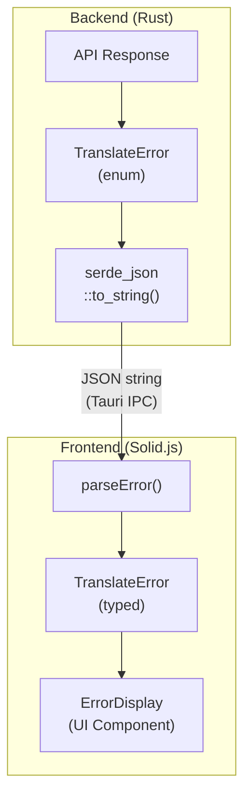

# Error Management Strategy

This document outlines TrayLingo's approach to error handling, logging, and monitoring.

## Overview

TrayLingo uses a **structured error approach** with typed errors that flow from Rust backend to TypeScript frontend, enabling consistent error handling and user-friendly messages.

## Architecture



## Error Types

### TranslateError Enum

| Type | Trigger | HTTP Status | Retryable |
|------|---------|-------------|-----------|
| `ApiKeyMissing` | No API key configured | - | No (needs settings) |
| `AuthenticationFailed` | Invalid API key | 401 | No (needs settings) |
| `RateLimitExceeded` | Too many requests | 429 | Yes (with delay) |
| `Overloaded` | Claude API overloaded | 529 | Yes (with delay) |
| `Timeout` | Request timeout | - | Yes |
| `NetworkError` | Connection failed | - | Yes |
| `ApiError` | Other API errors | 4xx/5xx | Depends |
| `ParseError` | Invalid response format | - | Yes |
| `Unknown` | Unexpected errors | - | No |
| `IncompleteResponse` | Stream ended without `message_stop` | - | Yes |

### File Locations

| Layer | File | Purpose |
|-------|------|---------|
| Rust | `src-tauri/src/error.rs` | Error enum definition |
| TypeScript | `src/types/error.ts` | Type definitions + utilities |
| UI | `src/components/ErrorDisplay.tsx` | Error display component |

## Frontend Utilities

```typescript
import { parseError, getUserMessage, isRetryable, needsSettings, getRetryDelay } from './types/error';

// Parse error from backend
const error = parseError(backendError);

// Get user-friendly message
const message = getUserMessage(error);

// Check if retryable
if (isRetryable(error)) {
  const delay = getRetryDelay(error);
  // Retry after delay
}

// Check if needs API key configuration
if (needsSettings(error)) {
  // Show settings button
}
```

## Logging Strategy

### Current Implementation

TrayLingo uses `tauri-plugin-log` for local logging:

```rust
// Cargo.toml
tauri-plugin-log = "2"
log = "0.4"
```

Log files are stored in the app's data directory:
- macOS: `~/Library/Logs/com.traylingo.app/`

### Recommended Usage

```rust
use log::{info, warn, error, debug};

// In translate_stream():
info!("Starting translation: {} chars", text.len());
error!("API error: status={}, body={}", status, body);
warn!("Rate limited, retry_after={:?}", retry_after);
debug!("Stream chunk received: {} bytes", chunk.len());
```

### Log Levels

| Level | Use Case |
|-------|----------|
| `error!` | Failed operations, API errors |
| `warn!` | Rate limits, retryable failures |
| `info!` | Successful operations, state changes |
| `debug!` | Detailed debugging info (dev only) |

## Error Monitoring Tools

### Sentry Integration

TrayLingo uses Sentry for error monitoring on both frontend and backend.

| Component | Project | Package |
|-----------|---------|---------|
| Frontend (Solid.js) | `traylingo-frontend` | `@sentry/solid` |
| Backend (Rust) | `traylingo-backend` | `sentry` |

### Configuration

**Frontend** (`src/index.tsx`):
```typescript
import * as Sentry from "@sentry/solid";

Sentry.init({
  dsn: "YOUR_FRONTEND_DSN",
  // NOTE: sendDefaultPii is intentionally NOT set (defaults to false)
  // to avoid sending IP addresses, user agents, etc.
  beforeSend(event) {
    // Filter sensitive data from breadcrumbs
    if (event.breadcrumbs) {
      event.breadcrumbs = event.breadcrumbs.map((breadcrumb) => {
        if (breadcrumb.data) {
          delete breadcrumb.data.text;
          delete breadcrumb.data.translation;
          delete breadcrumb.data.clipboard;
        }
        return breadcrumb;
      });
    }
    return event;
  },
});
```

**Backend** (`src-tauri/src/lib.rs`):
```rust
let _sentry_guard = sentry::init((
    "YOUR_BACKEND_DSN",
    sentry::ClientOptions {
        release: sentry::release_name!(),
        // NOTE: send_default_pii is intentionally NOT set (defaults to false)
        before_send: Some(Arc::new(|mut event| {
            // Filter sensitive data from extras
            if let Some(extra) = event.extra.as_mut() {
                extra.remove("text");
                extra.remove("translation");
                extra.remove("clipboard");
            }
            Some(event)
        })),
        ..Default::default()
    },
));
```

### sentry-cli

The project uses `sentry-cli` for release management and source map uploads.

```bash
# Check connection
sentry-cli info

# List projects
sentry-cli projects list --org YOUR_ORG
```

Install via mise (configured in `.tool-versions`).

### Rust Panic Capture

Rust panics require special handling to ensure they're captured by Sentry before the process aborts.

**Problem**: Sentry's default `PanicIntegration` uses thread-local Hub, which can fail in spawned threads.

**Solution** (in `src-tauri/src/lib.rs`):

```rust
// Store guard in static (not Tauri managed state)
static SENTRY_GUARD: Mutex<Option<sentry::ClientInitGuard>> = Mutex::new(None);

fn install_panic_handler_with_flush() {
    let prev_hook = std::panic::take_hook();

    std::panic::set_hook(Box::new(move |panic_info| {
        // Use Hub::main() to get the original Hub from init
        if let Some(client) = sentry::Hub::main().client() {
            if client.is_enabled() {
                let event = sentry::protocol::Event {
                    message: Some(panic_info.to_string()),
                    level: sentry::Level::Fatal,
                    ..Default::default()
                };

                // Direct client call bypasses thread-local Hub issues
                client.capture_event(event, None);

                // Explicit timeout ensures delivery before abort
                client.flush(Some(std::time::Duration::from_secs(2)));
            }
        }
        prev_hook(panic_info);
    }));
}
```

**Key points**:
- Use `Hub::main().client()` instead of `Hub::current()` to avoid thread-local issues
- Use `client.capture_event()` directly instead of `sentry::capture_event()`
- Flush with explicit timeout (2 seconds) to ensure HTTP request completes
- Store guard in static `Mutex<Option<...>>`, not Tauri's managed state

See [article/native-app-debugging-pain.md](../article/native-app-debugging-pain.md) for the debugging journey.

### Privacy Considerations

- DSN is public (designed for client-side use)
- Configure **Allowed Domains** in Sentry dashboard to prevent abuse
- API keys are filtered before sending to Sentry
- `sendDefaultPii` / `send_default_pii` is NOT enabled (IP addresses not attached to events)
- Translation text, clipboard content, and source text are scrubbed via `beforeSend` filters
- Users can disable telemetry entirely via Settings > "Send error reports"

## Error Reporting for GitHub Issues

Users can copy error details directly from the error display for bug reports.

### Usage

When an error occurs, click the "Copy Report" button to copy a GitHub Issue-ready report:

```markdown
## Error Report

**Type**: `RateLimitExceeded`
**Message**: Rate limit exceeded. Please wait 30 seconds.
**Time**: 2025-12-05T18:00:00.000Z
**Model**: claude-haiku-4-5-20251001

### Details
```json
{
  "retry_after_secs": 30
}
```
```

### Implementation

```typescript
import { generateErrorReport, ErrorReportContext } from './types/error';

const context: ErrorReportContext = { model: 'claude-haiku-4-5-20251001' };
const report = generateErrorReport(error, context);
```

## Error History Storage

Errors are automatically logged to local storage for debugging patterns.

### Storage Location

Stored in `settings.json` under `error_history` key (same file as app settings).

### Data Structure

```typescript
interface ErrorHistoryEntry {
  timestamp: number;      // Unix timestamp (seconds)
  error_type: string;     // "RateLimitExceeded", "Timeout", etc.
  error_message: string;  // User-friendly message
  input_length: number;   // Length of text that triggered error
  model: string;          // Model used when error occurred
}
```

### Access via Tauri Commands

```typescript
// Get all error history (last 50 entries)
const history = await invoke<ErrorHistoryEntry[]>("get_error_history");

// Clear error history
await invoke("clear_error_history");
```

### Use Cases

- Debug recurring issues
- Identify patterns (e.g., "model X always times out with long texts")
- Provide context when reporting bugs

## Known Gaps & Future Improvements

### Low Priority

| Gap | Issue | Solution |
|-----|-------|----------|
| Offline detection | Request starts then fails | Check network before request |
| Content policy | Generic ApiError for violations | Parse error response for type |

### Completed

| Gap | Status |
|-----|--------|
| Streaming errors use string | ✅ Now uses `TranslateError::NetworkError` |
| Empty input not validated | ✅ Frontend guard added |
| Logs not used | ✅ `log::info!`, `error!`, `warn!` added |
| ParseError never fires | ✅ Now emits on JSON parse failure |
| Error report for issues | ✅ Copy Report button added |
| Incomplete response | ✅ `IncompleteResponse` error type + `message_stop` detection ([#13](https://github.com/ebiyy/traylingo/issues/13)) |
| No error history | ✅ Last 50 errors stored locally ([#14](https://github.com/ebiyy/traylingo/issues/14)) |

## Error Handling Checklist

When adding new features:

- [ ] Define error cases in `TranslateError` enum (if new type needed)
- [ ] Update TypeScript types in `src/types/error.ts`
- [ ] Add user-friendly message in `getUserMessage()`
- [ ] Determine if retryable and update `isRetryable()`
- [ ] Add appropriate log statements
- [ ] Test error paths manually

## Related Files

- [src-tauri/src/error.rs](../src-tauri/src/error.rs) - Rust error definitions
- [src/types/error.ts](../src/types/error.ts) - TypeScript types and utilities
- [src/components/ErrorDisplay.tsx](../src/components/ErrorDisplay.tsx) - Error UI component
