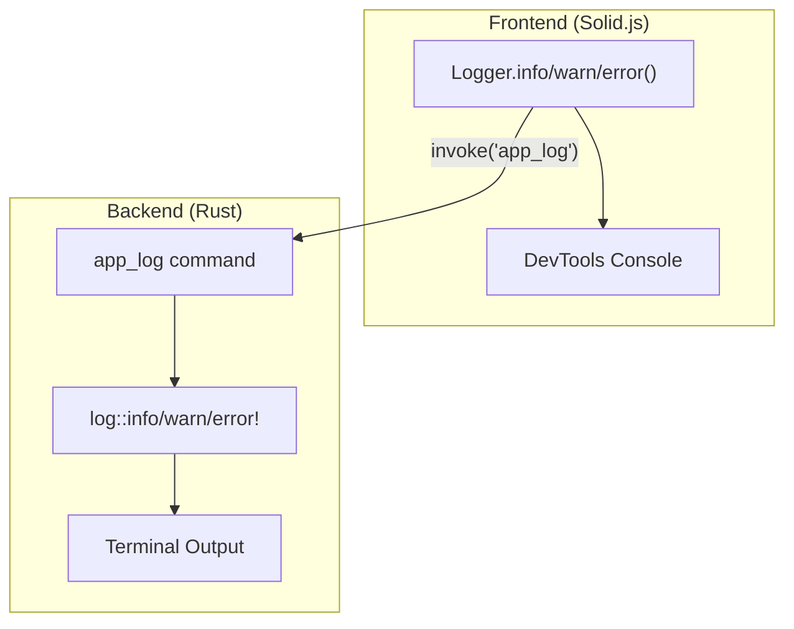

# Unified Logging Layer

This document describes TrayLingo's unified logging system for development debugging.

## Overview

TrayLingo uses a **unified logging layer** that consolidates logs from both frontend (Solid.js) and backend (Rust) into a single output stream in the Rust terminal. This enables easier debugging by providing a complete picture of application behavior in one place.

## Architecture



## Log Entry Format

```
[2025-12-05][17:45:22][traylingo_lib][INFO] [scope] [corr=correlation-id] message | data={...}
```

| Field | Description |
|-------|-------------|
| `scope` | Category: `ui`, `ipc`, `command`, `network`, `lifecycle`, `other` |
| `corr` | Correlation ID for tracing related operations |
| `message` | Human-readable log message |
| `data` | Optional JSON payload with additional context |

## Usage

### Frontend (TypeScript)

```typescript
import { Logger } from "../utils/logger";

// Basic logging
Logger.info("ui", "button clicked");
Logger.warn("network", "slow response", { latencyMs: 500 });
Logger.error("ipc", "command failed", { error: "timeout" });

// With correlation ID for tracing
const correlationId = crypto.randomUUID();
Logger.info("ipc", "translate start", { textLength: 100 }, correlationId);
// ... operation ...
Logger.info("ipc", "translate done", { resultLength: 50 }, correlationId);
```

### Backend (Rust)

Use the standard `log` crate macros:

```rust
log::info!("Starting translation: {} chars", text.len());
log::warn!("Cache miss");
log::error!("API request failed: {}", error);
```

## Log Scopes

| Scope | Usage |
|-------|-------|
| `ui` | User interactions (clicks, shortcuts, focus) |
| `ipc` | Tauri invoke/event communication |
| `command` | Rust command internal logic |
| `network` | External API calls |
| `lifecycle` | App startup, shutdown, routing |
| `other` | Miscellaneous |

## Key Files

| File | Purpose |
|------|---------|
| [src/types/logging.ts](../src/types/logging.ts) | TypeScript types (LogLevel, LogScope, LogEntry) |
| [src/utils/logger.ts](../src/utils/logger.ts) | Frontend Logger utility |
| [src-tauri/src/lib.rs](../src-tauri/src/lib.rs) | `app_log` command handler |

## Biome Console Rule

Direct `console.log/warn/error` usage is prohibited via Biome:

```json
{
  "linter": {
    "rules": {
      "suspicious": {
        "noConsole": "error"
      }
    }
  }
}
```

Use `Logger` instead. If console is truly needed, add a biome-ignore comment with justification.

## Development Workflow

1. Run `pnpm tauri dev`
2. All logs (frontend + backend) appear in the terminal
3. Use correlation IDs to trace operations across frontend/backend boundary
4. Filter logs by scope or level as needed

## Example Output

```
[2025-12-05][17:45:18][traylingo_lib][INFO] [lifecycle] [-] [corr=...] App mounted
[2025-12-05][17:45:22][traylingo_lib][INFO] [ui] [-] [corr=...] shortcut triggered (⌘J)
[2025-12-05][17:45:22][traylingo_lib][INFO] [ipc] [abc-123] [corr=...] translate start | data={"textLength":18}
[2025-12-05][17:45:22][traylingo_lib::anthropic][INFO] Starting translation: 18 chars
[2025-12-05][17:45:22][traylingo_lib::anthropic][INFO] Cache hit for translation (18 chars)
[2025-12-05][17:45:22][traylingo_lib][INFO] [ipc] [abc-123] [corr=...] translate done
```
